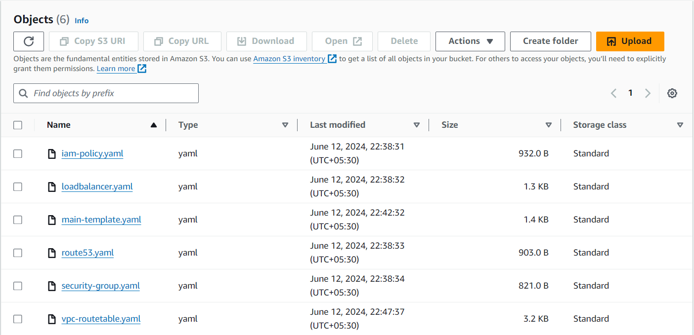
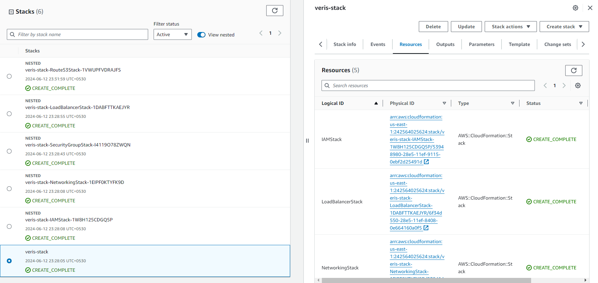

# Cloudformation

Instead of using a traditional single template approach, I followed a nested cloud formation stack approach. This approach provides easier management and allows for component reusability.

For the individual module templates, you can find them in the [cloudformation modules](./cloudformation/) folder.

I have created a main template file that references all the module templates. You can access the main template file [here](./cloudformation/main-template.yaml).

Once the files were ready, I uploaded them to an S3 bucket. Here's a screenshot of the S3 bucket: 

Using the CloudFormation UI, I successfully created the stack with the required details. Here's a screenshot of the successful stack creation: 

## Resources created: 

- VPC with two public subnets and two private subnets. 
- A routetable for each subnet, internet gateway to allow public subnets for internet access. [Image here](./cloudformation/images/vpc.png)
- A security group which allows access to ports 22, 80, and 443 (port 22 access is specifically allowed for creating instances in the next task) [Image here](./cloudformation/images/2024-06-13_00-02.png)
- ELB and ALB [Image here](./cloudformation/images/lbs.png)
- Route53 with CNAME entry for ALB and ELB [Image here](./cloudformation/images/r53.png)

