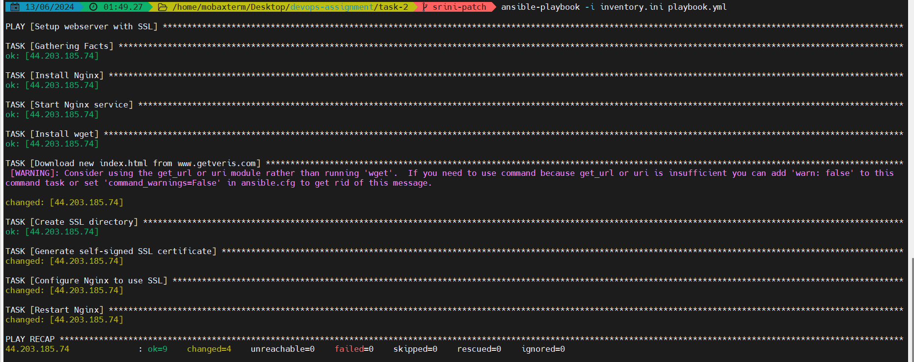
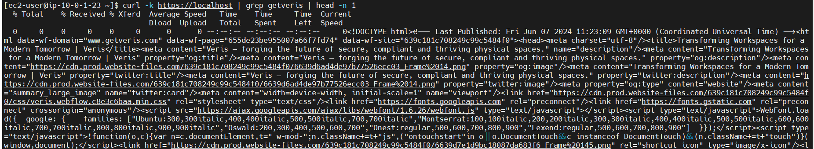

## Ansible playbook

I have already created an AWS instance named `veris-ec2`. This instance is in public subnet that was created as part of previous task. 

I have created a `.pem` file to access the instance via ssh. and this .pem key is used access ansible_host which is our ec2 instance and perform actions as follows:

- Preparing webserver:
    - I choosed nginx as it is easy to configure. 
    - Instead of using some sample webserver from github, I have used getveris.com site and used `wget` utility and changed the default page of nginx. 
    - Securing the web server
        - One of the important measures I did was generating ssl certifcates which allows secure access. Also making the ssl folder only accessible to some users will prevent unauthorized changes to certs. 
        - There are couple of steps we can do to secure webserver such as enabled firewall rules to only allow necassary traffic to server. 
    - Creating ssl certificates and securing the demo site and adding the redirect to page. 

### Results:
#### Ansible playbook run results: 

#### Https redirection: 

### resources used: 
https://www.digitalocean.com/community/tutorials/how-to-create-a-self-signed-ssl-certificate-for-nginx-on-centos-7 