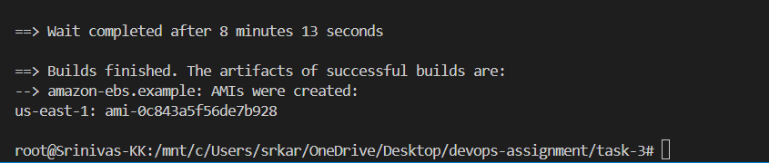
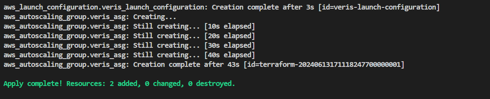
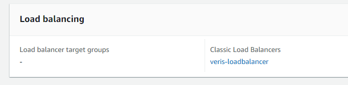
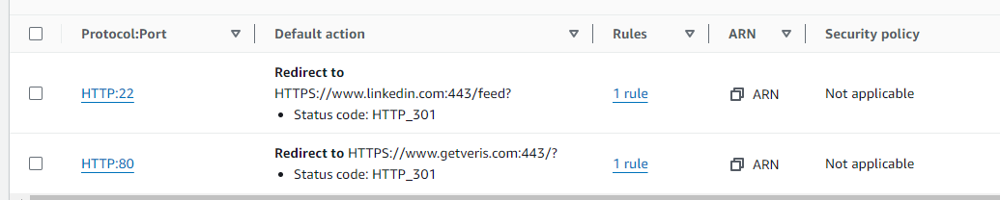

### Using Packer to Create a Custom AMI

- I used the Amazon Linux AMI as the base AMI: `ami-0eaf7c3456e7b5b68`.
- To run Ansible, I installed Ansible using the `shell` provisioner.
- To run the Ansible playbook, I used the `ansible` provisioner, which uses the Ansible playbook located in the same directory.
  - We can make this more dynamic by uploading the Ansible playbook to an object store like S3, pulling it into the instance, and referencing it in the Packer file.

Packer build result:

### Using Terraform to Create an ASG

- We are using Terraform to create the ASG.
- All the needed resources, such as subnets and security groups, were already created as part of task 1. We will use those resources as variables in this Terraform code to create the ASG.

- The ASG is attached to the ELB via the AWS Console.

### Multi-Domain Hosting

- Using the AWS Console, I created two target ports for the ALB. Since we did not allow ports other than 80, it was not possible to serve two sites. However, for one target group, I added getveris.com, and the ALB is serving it.

** Ignore the port 22 target group.