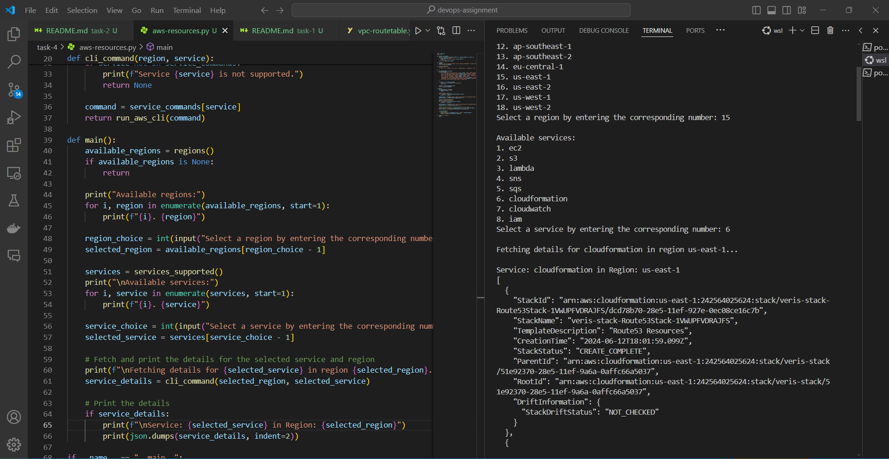

# AWS Resource Details Listing Script

This script is used to list the details of AWS resources being used in a specified AWS region. The script asks user for the region and provides a list of pre-defined resources along with their details. Based on the user input, the script will run awscli command and list the details on terminal. 

Script primarly used `subprocess` package which is used to run cli commands and process output in your code. We can also use `boto3` for AWS actions. 

## Limitations
- Script can only process the resources that are hard defined in the code.